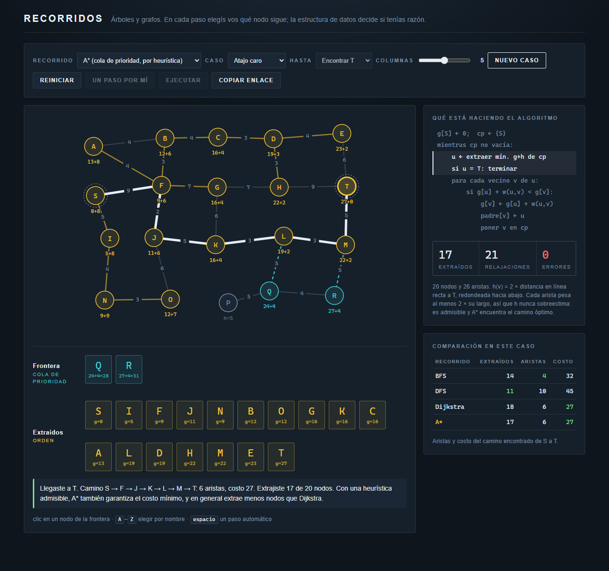

# Traversaltoy

Visualizador interactivo de recorridos de árboles y grafos: DFS en preorden, inorden y postorden, y BFS por niveles, sobre un árbol binario de búsqueda; BFS, DFS, Dijkstra y A* sobre un grafo ponderado. En cada paso, el que decide qué nodo sigue es quien lo usa, no el programa.

Material de apoyo de **25.03 Algoritmos y Estructuras de Datos**, Ingeniería Electrónica, ITBA.

[](https://mressl-itba.github.io/traversaltoy/)

**Demo:** <https://mressl-itba.github.io/traversaltoy/>

## La idea

BFS, DFS, Dijkstra y A* son el mismo algoritmo:

```text
frontera ← {S}
mientras frontera no vacía:
    u ← sacar un nodo de la frontera
    agregar (o actualizar) los vecinos de u en la frontera
```

Lo único que cambia es **qué estructura es la frontera**, y por lo tanto qué nodo sale:

| Recorrido | Frontera | Sale primero |
| --- | --- | --- |
| BFS | cola | el que entró primero |
| DFS | pila | el que entró último |
| Dijkstra | cola de prioridad | el de menor `g` (costo acumulado desde S) |
| A* | cola de prioridad | el de menor `f = g + h` (`h` estima lo que falta hasta T) |

En el selector, el paréntesis de cada recorrido es siempre su frontera: `BFS (cola)`, `DFS (pila)`, `Dijkstra (cola de prioridad)`, `A* (cola de prioridad, por heurística)`. Dijkstra y A\* usan la misma estructura; lo que cambia es la clave por la que se ordena, que en A\* suma la heurística.

Por eso están los cuatro en la misma herramienta y sobre el mismo grafo: al cambiar de algoritmo se conserva el caso, y la tabla de comparación muestra los resultados de cada uno lado a lado.

### Recorrer todo o encontrar T

El selector **Hasta** elige entre dos variantes:

- **Recorrer todo** (por defecto). El recorrido sigue hasta que la frontera se vacía y visita todos los nodos alcanzables desde S. Es la forma básica de BFS y DFS, y la de Dijkstra como algoritmo de caminos mínimos desde un origen. Lo que queda es un árbol (las aristas amarillas), y la tabla compara su **profundidad máxima**, en la que gana BFS, y la **suma de costos acumulados** de S a cada nodo, en la que gana Dijkstra.
- **Encontrar T**. Se agrega la línea `si u = T: terminar`, y el recorrido corta apenas extrae el destino. La tabla compara nodos extraídos, aristas y costo del camino encontrado.

A* está siempre en **Encontrar T**, porque su heurística mide la distancia a un destino y sin destino no hay nada que estimar.

Con los árboles pasa lo mismo, y por eso los nombres del selector lo dicen: **BFS por niveles** usa una cola, y **DFS preorden**, **inorden** y **postorden** usan una pila implícita, la pila de llamadas, que se muestra como frontera. Los tres DFS recorren el árbol igual; lo único que cambia es en qué momento se visita cada nodo: al entrar, entre los dos hijos o al salir. El inorden solo tiene sentido en árboles binarios.

## Qué muestra

- **El tablero** pinta cada nodo según su estado: gris si todavía no se descubrió, celeste si está en la frontera, amarillo si ya salió. Las aristas amarillas forman el árbol de búsqueda (`padre[v]`), las punteadas celestes son padres tentativos que todavía pueden cambiar, y, con **Encontrar T**, al terminar el camino a T queda en blanco.
- **La frontera** aparece debajo como fila de tarjetas, con `frente` o `tope` marcado según corresponda. En la cola de prioridad las tarjetas quedan en orden de inserción, **sin ordenar**: encontrar el mínimo es trabajo de quien usa la herramienta.
- **Si la elección es incorrecta**, el nodo rebota y el mensaje explica por qué. Si en A* se elige el de menor `g` en lugar del de menor `f`, el mensaje lo señala como "lo que haría Dijkstra".
- **Los empates** en la cola de prioridad se aceptan todos. En BFS y DFS no hay empates: la estructura decide sola.
- **El pseudocódigo** al costado resalta las líneas que se acaban de ejecutar.
- **Los contadores** cambian según el modo. En grafos, nodos extraídos e inserciones (o relajaciones). En árboles, nodos visitados y tamaño máximo de la pila o de la cola.

## Casos preseteados

**Grafos** (grilla de 4 filas y 4 a 6 columnas):

| Caso | Qué muestra |
| --- | --- |
| Grilla aleatoria | El caso típico |
| Atajo caro | La fila que une S con T en línea recta tiene pesos altos. Con **Encontrar T**, BFS la toma (menos aristas) y paga de más; Dijkstra y A* la esquivan. |
| Con pared | Una pared corta el paso salvo por abajo. Con **Encontrar T**, A* va derecho hacia la pared y tiene que retroceder, pero igual encuentra el óptimo. |

Los pesos son siempre al menos el doble del largo de la arista, y `h(v)` es el doble de la distancia en línea recta a T, redondeado hacia abajo. Así `h` es admisible y consistente, y A* devuelve siempre el mismo costo que Dijkstra.

**Árboles** (BST con 5 a 15 claves):

| Caso | Qué muestra |
| --- | --- |
| BST aleatorio | El caso típico |
| Completo | Altura mínima: la pila es chica y la cola es ancha |
| Degenerado (lista) | Altura máxima: la pila crece hasta `n` y la cola nunca pasa de 1 |

## Parámetros de URL

Se puede fijar el recorrido y el caso completo desde la URL, para linkear un ejemplo puntual desde una filmina o un enunciado.

| Parámetro | Valores | Notas |
| --- | --- | --- |
| `recorrido` | `pre`, `in`, `post`, `niv`, `bfs`, `dfs`, `dij`, `ast` | |
| `caso` | árboles: `random`, `completo`, `degenerado` · grafos: `random`, `atajo`, `pared` | |
| `arbol` | claves separadas por coma, en orden de inserción, hasta 15 | solo árboles; define el BST exacto |
| `n` | columnas del grafo, de 4 a 6 | solo grafos |
| `semilla` | un entero | solo grafos; la misma semilla con el mismo `caso` y `n` da el mismo grafo |
| `destino` | `1` | solo grafos; corta al extraer T (**Encontrar T**). Sin el parámetro, recorre todo. A* lo ignora: siempre busca T |

```text
https://mressl-itba.github.io/traversaltoy/?recorrido=in&arbol=50,30,70,20,40,60,80
https://mressl-itba.github.io/traversaltoy/?recorrido=niv&caso=degenerado&arbol=10,20,30,40,50
https://mressl-itba.github.io/traversaltoy/?recorrido=bfs&caso=random&n=5&semilla=42
https://mressl-itba.github.io/traversaltoy/?recorrido=dij&caso=atajo&n=6&semilla=1234&destino=1
https://mressl-itba.github.io/traversaltoy/?recorrido=ast&caso=pared&n=6&semilla=1234
```

Los grafos se pasan por semilla, y no arista por arista, porque una grilla de 24 nodos con pesos y posiciones no entra cómoda en una URL. Al cambiar de recorrido en la página, la semilla se conserva: el enlace con `recorrido=dij` y el mismo con `recorrido=ast` muestran el mismo grafo.

El botón **Copiar enlace** devuelve la URL del caso que está en pantalla, incluido el caso generado al azar. Sirve para capturar un caso que salió bien mientras se prepara el material.

## Controles

| Acción | Cómo |
| --- | --- |
| Elegir un nodo | clic en el tablero o en la tarjeta de la frontera |
| Elegir un nodo por nombre (grafos) | la letra del nodo, `A`–`Z` |
| Un paso automático | `espacio`, o el botón **Un paso por mí** |
| Correr todo | botón **Ejecutar** |
| Recorrer todo o cortar en T (grafos) | selector **Hasta** |
| Repetir el mismo caso | botón **Reiniciar**, o cambiar de recorrido |
| Nuevo caso | botón **Nuevo caso**, o `Enter` |

## Sugerencia de uso en clase

1. **Árboles.** Empezar con **DFS inorden** sobre un BST aleatorio y dejar que lo resuelvan a mano: la salida ordenada aparece sola. Pasar a **BFS por niveles** y **DFS preorden** sobre el caso **Completo** y después sobre el **Degenerado**, comparando la pila máxima con la cola máxima. De ahí sale que el espacio depende de la altura en un caso y del ancho en el otro.
2. **BFS y DFS.** Con **Recorrer todo**, resolverlos a mano sobre el mismo grafo. Tienen el mismo código salvo la estructura: los dos visitan todos los nodos, pero el orden de visita y la forma del árbol cambian por completo. Comparar la profundidad máxima en la tabla: el árbol BFS es ancho y bajo, el DFS largo y flaco.
3. **Dijkstra.** Todavía con **Recorrer todo**, resolverlo a mano y comparar la suma de costos acumulados con BFS: el árbol de menos aristas no es el de caminos más baratos.
4. **Buscar un destino.** Pasar a **Encontrar T** sobre **Atajo caro**. Correr BFS con **Ejecutar** y después Dijkstra, y comparar los costos del camino a T y cuántos nodos hizo falta extraer para llegar.
5. **A\*.** Sobre el mismo caso, resolver A* y comparar la columna de extraídos con Dijkstra. Cerrar con **Con pared** para mostrar que la heurística ayuda pero no adivina.

## Estructura

Un solo archivo. El HTML, el CSS y el JavaScript están juntos, sin build ni empaquetado, para que se pueda leer y modificar de una sentada.

```text
index.html
README.md
img/screenshot.png
```

Los colores están definidos como variables CSS al principio del archivo (`--ch1` son los visitados, `--ch2` la frontera). La generación de casos vive en `genArbol()` y `genGrafo()`, y el paso de cada algoritmo sobre grafos en `extraer()`. La lectura y escritura de parámetros vive en `leerURL()` y `escribirURL()`.

## Licencia

MIT.
